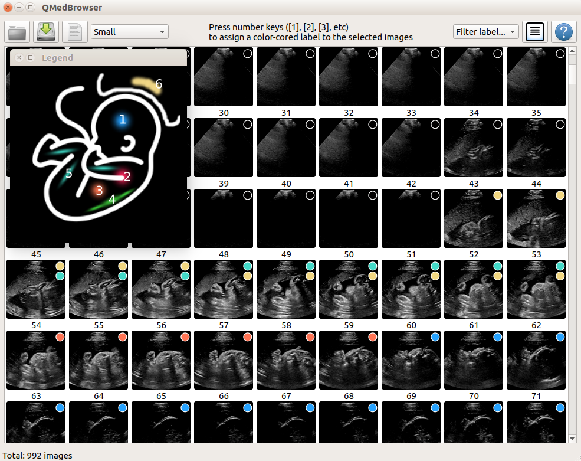
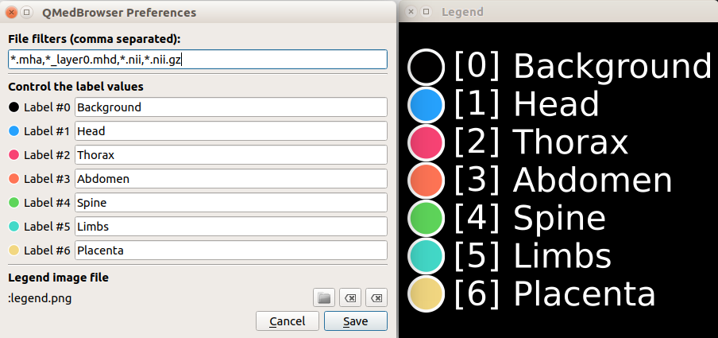

# Medical Image Browsing using Qt

Utility tool for browsing and labelling (medical) images rapidly and efficiently.

This work was used for the production of the paper 'Weakly Supervised Localisation for Fetal Ultrasound Images', DLMIA'18:

[[Project Page]](https://ntoussaint.github.io/fetalnav)
[[Paper]](https://arxiv.org/abs/1808.00793)



**A Qt based tool to browse and assign labels/annotations to large number of images.**

## Context

In the recent years, there has been a surge in computer vision based methods applied to the medical world. In particular, neural networks are now often used for classification, segmentation and other tasks that are very relevant to the medical image community.

Neural network approaches are notoriously data hungry, and often require a very large amount of annotated data for training. In the computer vision community applied to natural images, such annotation and labelling requirements are often crowd sourced. As a consequence it is relatively easy to obtain very large amount of annotated data. In the medical image community however, the annotation task is often difficult and very time consuming.

## Contribution

This tool attempts to provide an easy and flexible browser, dedicated to medical images, for the purpose of image-wise annotation tasks. Simply open a folder containing medical image files, select batches of images and assign label(s) to them. The labels can either be saved in the original image file as a metadata, or in the form of a spreadsheet. The system is flexible to the application at hand, as the user can change the legend image or the color-to-label code.

## Requirements

This repository requires [CMake](https://cmake.org/), [Qt](https://www.qt.io/), and the [Insight ToolKit](https://itk.org/).

The system is relatively light-weight at run-time, and the memory load is of the order of 1MB/image. For instance, with a 16GB RAM memory, a folder containing 10,000 images can be opened without much discomfort.


## Usage

- Open a folder containing medical image files

- The images are loaded as icons. Control the icon size with the multiple-choice on the toolbar

- Open the legend with the help button

- Select one or more images with the keyboard or the mouse.

- Press [1], [2], [3], etc to toggle a certain label to assign to the selected images

- Save the resulting spreadsheet, or write the labels into the metadata of each image file.


## Configuration

The system is highly configurable. Through the configuration dialog, the user is invited to control:

1. The filters that are used to load image files
2. The labels that are assigned by each number (maximum 7)
3. The legend that is displayed (via loading an external image)




## Citation

If you used the code/software for your research, please, cite the paper:
```bibtex
@inproceedings{toussaint.dlmia.18,
    author = {Toussaint, Nicolas and Khanal, Bishesh and Sinclair, Matthew and Gomez, Alberto and Skelton, Emily and Matthew, Jacqueline and Schnabel, Julia A.},
    title = {Weakly Supervised Localisation for Fetal Ultrasound Images},
    booktitle = {Proceedings of the 4th Workshop on Deep Learning in Medical Image Analysis},
    year = {2018},
    note={\href{https://arxiv.org/abs/1808.00793}{[url]}}
}
```


## Author

    Nicolas Toussaint, PhD
    School of Biomedical Engineering,
    King's College London

**Contact**: <nicolas.a.toussaint@kcl.ac.uk> <nicolas.toussaint@gmail.com>
